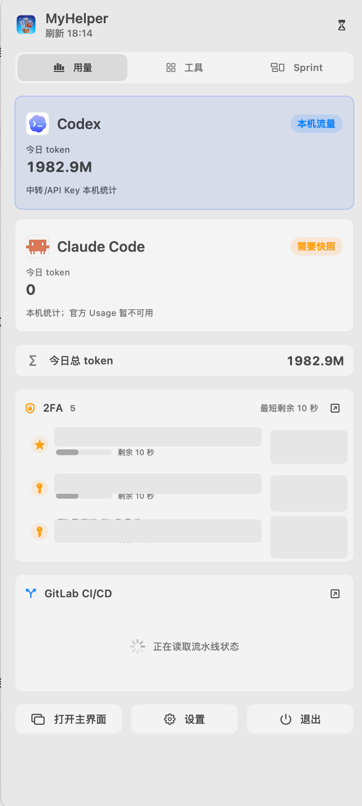
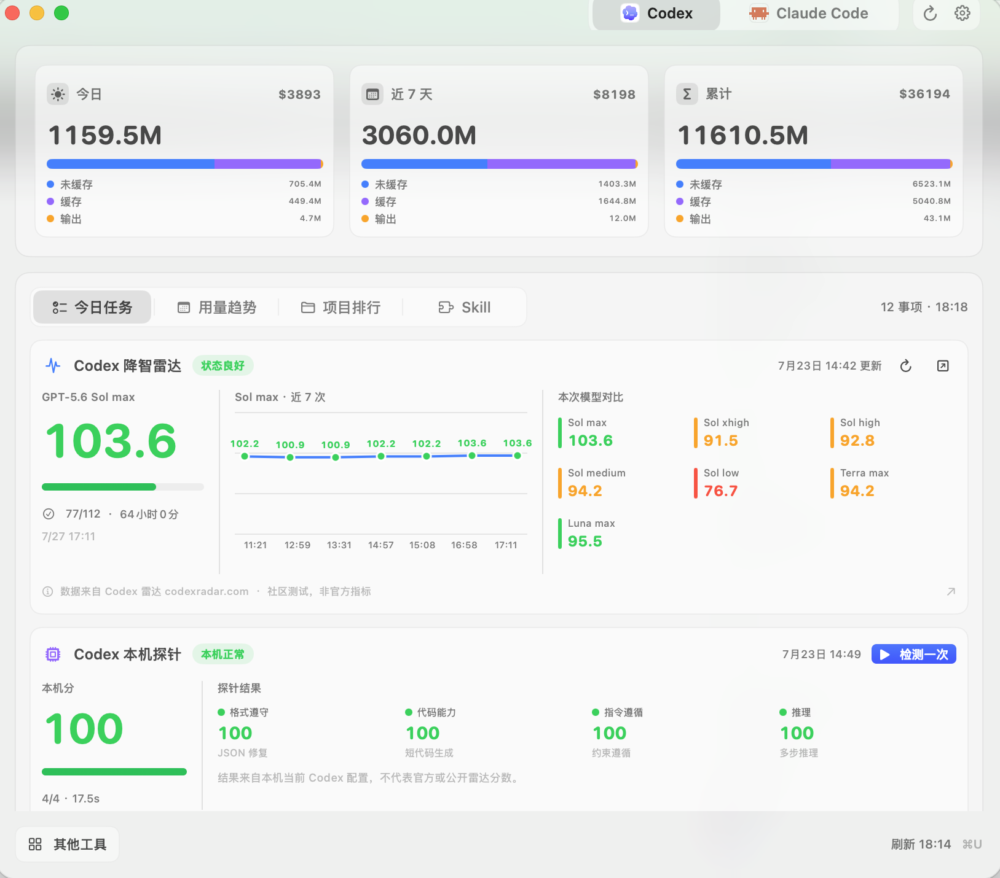
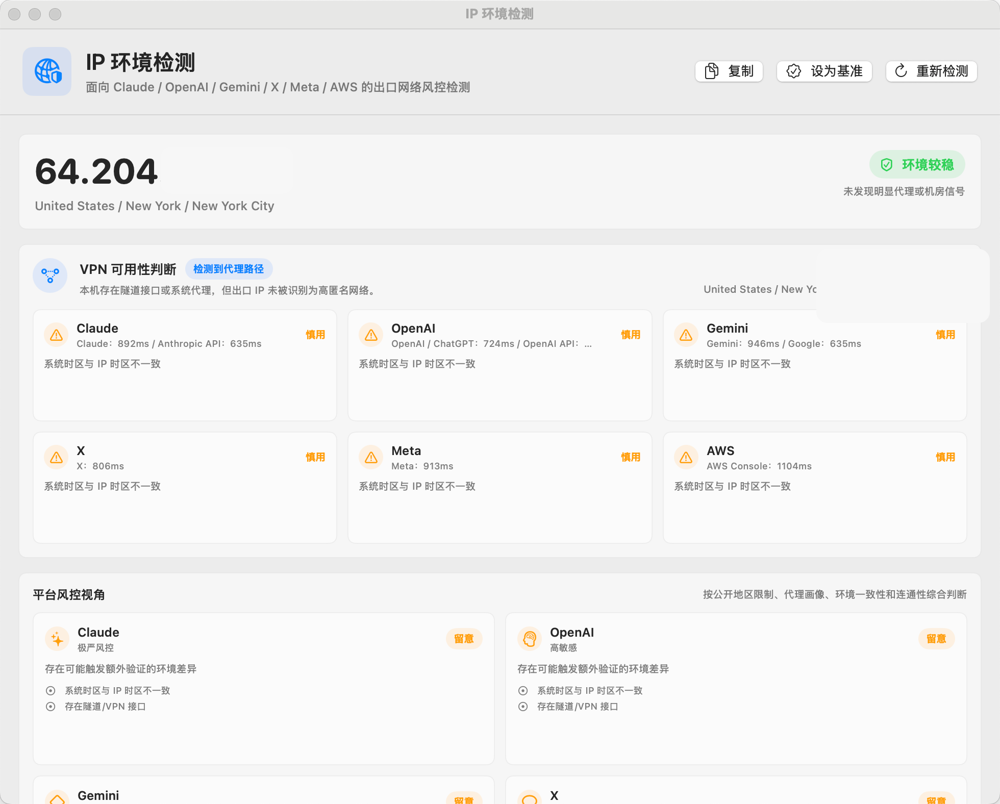

# MyHelper

MyHelper is a local macOS menu bar utility for developers. It brings AI coding usage, network risk checks, GitLab CI/CD status, task capture, 2FA, and everyday developer tools into one desktop app.

## Preview

The menu bar popover keeps AI usage, 2FA, GitLab CI/CD, and common actions in a compact panel:



The main window shows local Codex / Claude Code usage, trends, project rankings, radar, and local probes:



The IP environment tool checks the current exit network, VPN/proxy route, and connectivity to sensitive platforms:



## What It Does

- **AI usage dashboard**: inspect local Codex and Claude Code tokens, trends, project rankings, tool usage, and task status.
- **Menu bar status**: check Codex / Claude Code at a glance and open the main window, settings, or tools quickly.
- **Relay and unofficial endpoint support**: when official quota APIs are unavailable, MyHelper still summarizes local token usage from session records.
- **Radar and local probes**: show Codex / Claude Code radar information and provide a first local model-capability probe surface.
- **IP environment checks**: inspect public IP, ASN, ISP, proxy/VPN/Tor/datacenter signals, local interface details, DNS, system proxy, tunnel interfaces, and connectivity to Claude, OpenAI, Gemini, X, Meta, AWS, and more.
- **VPN usability view**: when a VPN is enabled but you are unsure whether it is safe or usable for Claude/OpenAI/Gemini, MyHelper labels each target as usable, degraded, risky, or unusable.
- **GitLab tools**: manage GitLab instances, project lists, bulk clone, branch matching, and CI/CD pipeline monitoring.
- **MindAnchor tasks**: capture local tasks, OCR, speech-to-task, Sprint board, and menu bar task summaries.
- **Developer toolkit**: JSON editing/formatting/folding, JSON diff, JWT, encoding/decoding, regex, hashes, and related utilities.
- **2FA authenticator**: manage local TOTP accounts, import otpauth / QR codes, and copy current codes quickly.

## Design Principles

- **Local first**: usage, threads, tokens, account-related files, and secrets stay on the machine whenever possible.
- **Fast status reading**: the UI is optimized for answering “can I use this now?”, “what changed?”, and “what is risky?”.
- **Plugin-style tools**: AI usage is one surface; GitLab, IP checks, 2FA, MindAnchor, and developer utilities are separate tools.
- **Official and relay modes both matter**: unavailable official usage APIs should not make local traffic invisible.

## Install

Download the DMG for your Mac architecture from GitHub Releases:

- Apple Silicon: `MyHelper-<version>-mac-arm64.dmg`
- Intel: `MyHelper-<version>-mac-x86_64.dmg`

Steps:

1. Open the DMG.
2. Drag `MyHelper.app` into `Applications`.
3. Open MyHelper from `Applications`.
4. If macOS blocks the first launch, open **System Settings > Privacy & Security** and choose **Open Anyway**.

You can also right-click `MyHelper.app` in Finder, choose **Open**, and confirm the system prompt.

## Requirements

- macOS 14 or later.
- Xcode Command Line Tools for building from source.
- Codex / Claude Code usage features require local data from those tools.
- GitLab features require user-configured GitLab hosts and Personal Access Tokens; tokens are stored locally in Keychain.
- 2FA data is local and should never be committed to the repository.

## Data Sources

MyHelper may read these local or user-configured sources:

- Codex: `codex app-server`, `~/.codex/state_5.sqlite`, `~/.codex/sessions/**/*.jsonl`, `~/.codex/automations/**/automation.toml`.
- Claude Code: `~/.claude/projects/**/*.jsonl`, `~/.claude/tasks/**/*.json`, and optional local usage/statusline cache files.
- GitLab: user-configured GitLab APIs, without bundled tokens.
- IP environment: public IP lookup services, local network configuration, and HTTPS connectivity probes.
- 2FA: user-selected local TOTP storage or Keychain.

MyHelper is not an official product of OpenAI, Anthropic, GitLab, Google, Meta, X, or AWS.

## Build From Source

```sh
make build
```

Run:

```sh
make run
```

Install to `/Applications`:

```sh
make install
```

Inspect local data output:

```sh
make probe
```

Development run script:

```sh
./script/build_and_run.sh --verify
```

## Package

```sh
make release
```

Explicit architectures:

```sh
make release-arm64
make release-intel
make release-all
```

Artifacts are written to `dist/`. See [DISTRIBUTION.md](DISTRIBUTION.md) for Developer ID signing and notarization.

You can also package from the GitHub web UI:

1. Open **Actions** in the repository.
2. Select **Build macOS DMG**.
3. Click **Run workflow**.
4. Choose `arm64` or `x86_64`.
5. Download the DMG from workflow Artifacts, or enable Release publishing to upload it to GitHub Releases.

## Privacy And Security

- The repository does not include API keys, GitLab tokens, OAuth tokens, 2FA secrets, or account data.
- Sensitive configuration is stored locally through Keychain or user-selected local storage.
- Codex / Claude Code content is not uploaded; analytics read structured fields such as usage, model names, tool names, and project paths.
- `.gitignore` excludes `.env`, account JSON, credential JSON, token/secret files, local databases, logs, build outputs, and signing artifacts.

## FAQ

### Is MyHelper an official product?

No. MyHelper is an unofficial local macOS developer utility.

### Why can MyHelper show tokens when official usage is unavailable?

Official usage and local session statistics are separate paths. MyHelper uses local session records for traffic analysis when official quota data is unavailable.

### Can IP environment checks guarantee account safety?

No. They only report visible network signals such as VPN/proxy/Tor/datacenter IPs, region mismatch, unreachable services, and timezone inconsistency. Final risk decisions belong to each platform.

### Does MyHelper support Intel Macs?

Yes. Intel Macs should use `MyHelper-<version>-mac-x86_64.dmg`; source builds can use `make release-intel`.

## License

MIT. See [LICENSE](LICENSE).
