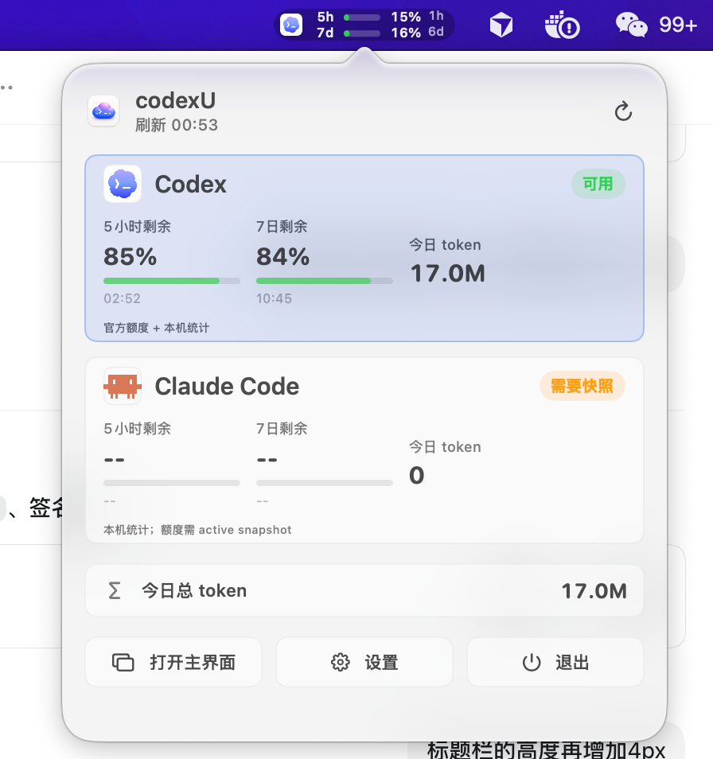

# MyHelper

[English](README.en.md)

MyHelper 是一个面向开发者的 macOS 菜单栏工具。它把 AI 编程助手用量、网络风控检测、GitLab CI/CD、任务捕获、2FA 和常用研发小工具放到一个本地应用里，目标很简单：少开几个窗口，少猜一点状态，把每天真正需要看的东西放到手边。



## 它能做什么

- **AI 用量看板**：查看 Codex、Claude Code 的本机 token、趋势、项目排行、工具调用和任务状态。
- **菜单栏快速状态**：在菜单栏直接查看 Codex / Claude Code 概览，并快速打开主窗口、设置和工具包。
- **非官方/中转流量统计**：官方额度接口不可用时，仍会从本机会话记录统计 token 和使用趋势。
- **降智雷达与本地探针**：展示 Codex / Claude Code 雷达信息，并提供一组本地模型能力探测入口。
- **IP 环境检测**：检测公网 IP、ASN、ISP、代理/VPN/Tor/机房画像、本机网卡、DNS、系统代理、隧道接口，以及 Claude、OpenAI、Gemini、X、Meta、AWS 等平台连通性。
- **VPN 可用性判断**：当你开了 VPN 但不确定能不能安全访问 Claude/OpenAI/Gemini 等平台时，MyHelper 会按连通性、地区、匿名网络、机房 IP、基准环境变化给出可用/慎用/高风险/不可用提示。
- **GitLab 工具**：管理 GitLab 实例、项目列表、批量 clone、分支匹配、CI/CD 流水线状态监控。
- **MindAnchor 任务工具**：本地任务捕获、OCR、语音转任务、Sprint 看板和菜单栏任务概览。
- **研发工具包**：JSON 编辑/格式化/折叠、JSON 对比、JWT、编码解码、正则、摘要等常用工具。
- **2FA 验证器**：管理本地 TOTP 账号，支持 otpauth / 二维码导入，验证码可一键复制。

## 设计原则

- **本地优先**：数据尽量从本机读取和计算，不把线程、token、账号数据上传到第三方服务。
- **状态要能扫一眼看懂**：菜单栏和主窗口优先展示“现在能不能用、还剩多少、哪里异常”。
- **工具是插件式的**：AI 用量只是入口之一，GitLab、IP 检测、2FA、研发工具包都作为独立工具存在。
- **中转和官方账号都要兼容**：官方 Usage 不可用不等于什么都不能展示，本机会话记录仍然有价值。

## 安装

从 GitHub Release 下载与你的 Mac 芯片匹配的安装包：

- Apple Silicon：`MyHelper-<version>-mac-arm64.dmg`
- Intel：`MyHelper-<version>-mac-x86_64.dmg`

安装步骤：

1. 打开 DMG。
2. 将 `MyHelper.app` 拖到 `Applications`。
3. 从 `Applications` 打开 MyHelper。
4. 如果 macOS 拦截，进入 **系统设置 > 隐私与安全性**，点击 **仍要打开**。

也可以在 Finder 中右键点击 `MyHelper.app`，选择 **打开**，再确认系统安全提示。

## 运行要求

- macOS 14 或更新版本。
- 从源码构建需要 Xcode Command Line Tools。
- Codex / Claude Code 用量功能需要本机存在对应工具的本地数据。
- GitLab 功能需要用户自行配置 GitLab 地址和 Personal Access Token，token 存储在本机 Keychain。
- 2FA 数据默认保存在本机，敏感内容不会提交到仓库。

## 数据来源

MyHelper 会按功能读取以下本机数据：

- Codex：`codex app-server`、`~/.codex/state_5.sqlite`、`~/.codex/sessions/**/*.jsonl`、`~/.codex/automations/**/automation.toml`。
- Claude Code：`~/.claude/projects/**/*.jsonl`、`~/.claude/tasks/**/*.json`，以及可选的本地 usage/statusline 缓存。
- GitLab：用户配置的 GitLab 实例 API，只在本机请求，不内置任何 token。
- IP 环境：公网 IP 查询服务、本机网络配置、HTTPS 连通性探测。
- 2FA：本机用户选择的 TOTP 数据源或 Keychain。

这些数据用于展示状态、趋势和本地工具能力。MyHelper 不是 OpenAI、Anthropic、GitLab、Google、Meta、X 或 AWS 的官方产品。

## 从源码构建

```sh
make build
```

运行：

```sh
make run
```

安装到 `/Applications`：

```sh
make install
```

检查本机数据源输出：

```sh
make probe
```

开发时也可以使用项目脚本：

```sh
./script/build_and_run.sh --verify
```

## 打包

```sh
make release
```

也可以显式打包不同架构：

```sh
make release-arm64
make release-intel
make release-all
```

产物会写入 `dist/`。Developer ID 签名和 Apple notarization 流程见 [DISTRIBUTION.md](DISTRIBUTION.md)。

## 隐私和安全

- 不提交、不内置任何 API Key、GitLab Token、OAuth Token、2FA 密钥或账号数据。
- GitLab Token、MindAnchor 凭证等敏感信息通过 Keychain 或用户本机配置保存。
- Codex / Claude Code 会话内容不上传；统计逻辑只读取 usage、模型、工具名、项目路径等结构化字段。
- `.gitignore` 已排除 `.env`、账号 JSON、credential JSON、token/secret 文件、本地数据库、日志、构建产物和签名包。

## 常见问题

### MyHelper 是官方产品吗？

不是。MyHelper 是非官方的本地 macOS 开发辅助工具。

### 为什么官方额度不可用时仍能显示 token？

因为 MyHelper 会从本机会话记录里读取 token 使用事件。官方 Usage 和本地统计是两条不同链路：前者用于账号额度，后者用于本地使用分析。

### IP 环境检测能保证账号安全吗？

不能保证。它只能根据公开可见的网络信号做风险提示，比如 VPN/代理/Tor/机房 IP、地区异常、服务不可达、时区不一致等。最终风控由各平台决定。

### 支持 Intel Mac 吗？

支持。Intel Mac 使用 `MyHelper-<version>-mac-x86_64.dmg`；从源码打包可使用 `make release-intel`。

## License

MIT. See [LICENSE](LICENSE).
