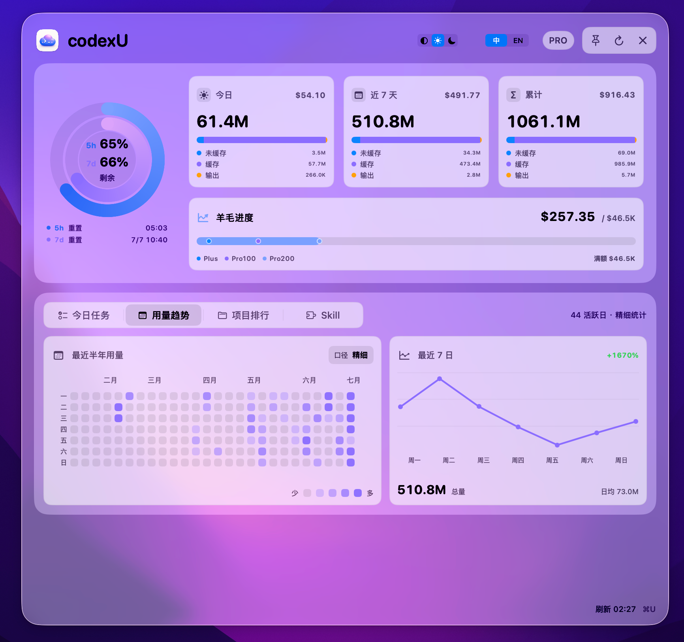
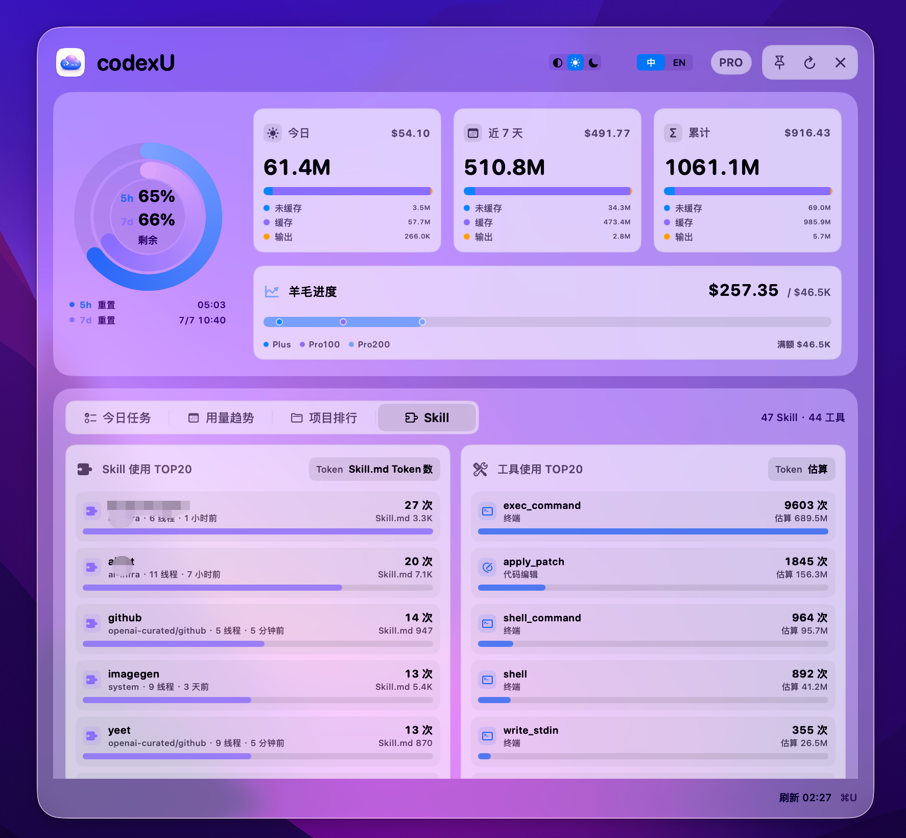

# MyHelper

[English](README.en.md)

MyHelper 是一个 macOS 菜单栏与桌面应用，用来查看 OpenAI Codex / ChatGPT Codex 和 Claude Code 的额度窗口、token 用量和今日任务状态。它把常用信息放在菜单栏和主窗口里，帮助你快速判断剩余额度、重置时间和当天工作进展。

## 界面截图







## 适合谁

- 经常使用 OpenAI Codex、Codex CLI 或 Codex 桌面应用的开发者。
- 同时使用 Codex 和 Claude Code 做开发，希望在一个入口查看两边本机用量的人。
- 需要快速查看 5 小时/7 天额度、token 用量和重置时间的 ChatGPT Pro / Team 用户。
- 想在桌面查看 Codex 使用状态、减少反复打开浏览器或终端的人。

## 功能

- 展示 Codex 5 小时和 7 天额度的剩余比例、已用比例和重置时间。
- 新增状态栏 Runtime 菜单：点击菜单栏图标后先展示 Codex / Claude Code 卡片、5 小时和 7 日剩余、今日 token 与总 token。
- 主界面顶部新增 `Codex | Claude Code` 全局开关，可手动切换所有面板的数据范围。
- 支持 Claude Code 本机 transcript 用量统计、最近 7 日趋势、项目排行、工具/Skill TOP 和任务看板基础能力。
- 汇总今日、近 7 天和累计 token 用量，并细分未缓存输入、命中缓存输入和输出。
- 按 OpenAI API token 价格估算本月 API 等效价值，并在 Plus、Pro 100、Pro 200 和满额月价值之间展示进度刻度。
- 下方仪表盘支持今日任务、用量趋势、项目排行和 Skill 使用视图。
- 从本机 Codex 线程和启用中的 automations 生成今日任务看板，按进行中、待处理、定时、完成四类组织任务。
- 展示最近半年的每日 token 热力图、最近 7 日趋势摘要和同周期变化。
- 展示最近 7 天与全部项目排行，包含 token、估算价值、线程数和最近活跃时间。
- 展示工具调用 TOP 列表和 Skill 使用 TOP 列表，帮助判断本地 Codex 工作结构。
- 以标准 macOS 窗口运行，支持 Dock、系统窗口控制、最小化和关闭主窗口后继续在菜单栏运行。
- 支持 `Command + U` 显示或隐藏主窗口；菜单栏 Runtime 菜单也可以快速打开主窗口、设置或退出。
- 设置窗口支持中文/英文界面、自动/浅色/深色外观、主窗口置顶和关闭行为配置。
- 本地读取数据，不上传 usage、线程或账户数据到第三方服务。

## 羊毛进度

“羊毛进度”是 MyHelper 对本月 Codex 使用量的 API 等效价值估算。它把本机解析到的未缓存输入、命中缓存输入和输出 token，按对应模型的 OpenAI API token 单价折算成美元金额，并和 Plus、Pro 100、Pro 200 以及满额月价值做对比。这个指标解决的问题是：Codex 额度本身通常只显示百分比和重置时间，token 数量也不容易直观看出“用了多少价值”；羊毛进度提供一个统一的金额口径，帮助你判断本月订阅成本大致回收到了哪个区间。

单次 token 用量的估算公式为：

```text
API 等效价值 =
  未缓存输入 tokens / 1,000,000 * 模型未缓存输入单价
+ 缓存输入 tokens / 1,000,000 * 模型缓存输入单价
+ 输出 tokens / 1,000,000 * 模型输出单价
```

其中 `未缓存输入 tokens = 输入 tokens - 缓存输入 tokens`，缓存输入按不超过输入 tokens 的数量计入。本月羊毛进度会累计当月所有本机 session 的 API 等效价值。进度条的满额终点使用 `2 亿 tokens/天 * 30 天` 估算，并按 30% 未缓存输入、50% 缓存输入、20% 输出的参考 token mix 折算；当前参考价约为 `$7.75 / 1M tokens`，满额月价值约 `$46,500`。进度条采用分段非线性刻度：Plus / Pro 节点保留在前段，超过 Pro 200 后用对数比例映射到满额终点，因此条宽用于扫视阶段进展，不等同于线性美元占比。该金额只是基于 API 价格的等效估算，不代表实际账单或官方返现金额。

## 快捷键和操作

- `Command + U`：显示或隐藏主窗口；如果窗口已最小化，会恢复并唤到前台。
- 菜单栏仪表图标：点击后打开 Runtime 菜单；点击 Codex 或 Claude Code 卡片会打开主界面并切到对应 Runtime。
- 菜单栏 Runtime 菜单：展示 Codex / Claude Code 快速状态，并提供打开主窗口、打开设置和退出。
- 设置窗口：配置语言、外观、主窗口置顶，以及关闭主窗口后是否继续在菜单栏运行。
- 主窗口顶部刷新按钮：立即刷新额度、token 统计、趋势图和任务看板。
- 系统红黄绿窗口按钮：关闭、最小化或缩放主窗口；退出请使用菜单栏 Runtime 菜单或 App 菜单。

## 首次安装：隐私与安全

MyHelper 目前通过 GitHub Release 的 DMG 安装包分发，不经过 Mac App Store。第一次打开时，macOS 可能会拦截，需要手动允许：

1. 打开 `MyHelper.app` 一次。如果系统提示无法打开，先取消弹窗。
2. 打开 **系统设置 > 隐私与安全性**。
3. 在 **安全性** 区域找到 `MyHelper.app`，点击 **仍要打开**。
4. 使用 Touch ID 或密码确认，然后点击 **打开**。

也可以在 Finder 中右键点击 `MyHelper.app`，选择 **打开**，再确认系统安全提示。

MyHelper 需要读取本机 `~/.codex/` 下的 Codex 数据；如果启用 Claude Code 统计，还会读取 `~/.claude/` 下的本机 transcript、任务和状态缓存。如果 macOS 弹出文件或文件夹访问授权，请允许访问，否则小组件无法读取本机 usage、线程和自动化任务信息。

## 安装

从 GitHub Release 下载与你的 Mac 芯片匹配的安装包：

- Apple Silicon：`MyHelper-<version>-mac-arm64.dmg`
- Intel：`MyHelper-<version>-mac-x86_64.dmg`

1. 打开 DMG。
2. 将 `MyHelper.app` 拖到 `Applications` 文件夹。
3. 从 `Applications` 打开 MyHelper。
4. 按上面的 **首次安装：隐私与安全** 步骤完成手动放行。

## 运行要求

- macOS 14 或更新版本。
- 本机已安装 Codex。
- 已登录 Codex 账户，额度信息才会显示。
- Codex 至少使用过一次，以便生成 `~/.codex/state_5.sqlite`。
- Claude Code 统计为可选能力；历史 token 来自 `~/.claude/projects/**/*.jsonl`，额度需要本地 statusLine snapshot cache。
- 从源码构建时需要 Xcode Command Line Tools。

## 从源码构建

```sh
make build
```

运行：

```sh
make run
```

安装到 `/Applications`：

```sh
make install
```

检查本机数据源输出：

```sh
make probe
```

## 打包 DMG

```sh
make release
```

`make release` 会按当前构建机器的架构输出安装包。也可以显式打包指定架构：

```sh
make release-arm64
make release-intel
make release-all
```

产物会写入 `dist/`，例如：

```text
dist/MyHelper-1.0.0-beta02-mac-arm64.dmg
dist/MyHelper-1.0.0-beta02-mac-arm64.dmg.sha256
dist/MyHelper-1.0.0-beta02-mac-x86_64.dmg
dist/MyHelper-1.0.0-beta02-mac-x86_64.dmg.sha256
```

Developer ID 签名和 Apple notarization 流程见 [DISTRIBUTION.md](DISTRIBUTION.md)。

## 数据来源

- 账户与额度：`codex app-server` 的 `account/read`、`account/rateLimits/read`、`account/usage/read`。
- 本机 token 总量：`~/.codex/state_5.sqlite`。
- 精细 token 拆分：`~/.codex/sessions/**/rollout-*.jsonl` 和 `~/.codex/archived_sessions/*.jsonl` 中的 `token_count` 事件。
- 今日任务看板：本机 SQLite 中未归档和今日归档的 Codex 线程。
- 用量趋势和项目排行：本机 session `token_count` 事件聚合；缺失精细事件时回退到线程更新时间的粗略口径。
- 工具和 Skill 使用：本机 session 事件中的工具调用与 Skill 加载记录。
- 定时任务：`~/.codex/automations/**/automation.toml` 中启用的 automation 元数据。
- Claude Code 历史 token：`~/.claude/projects/**/*.jsonl` 中 assistant message 的 `message.usage` 字段。
- Claude Code 工具、Skill 和任务：transcript 中的 `tool_use.name` / 显式 Skill attribution，以及 `~/.claude/tasks/**/*.json`。
- Claude Code active 额度：可选读取 `~/Library/Caches/MyHelper/claude-code/statusline-snapshot.json`；缺失时 5 小时/7 日额度显示为 `--`。

当前 Codex 额度 API 暴露的是滚动窗口百分比和重置时间，不暴露绝对配额数量；Claude Code 首版只读取本地历史记录和可选 active snapshot，不代表 Claude.ai 官方账单。更完整的数据口径和回退策略见 [RESEARCH.md](RESEARCH.md)。

## 常见问题

### MyHelper 是官方 OpenAI 产品吗？

不是。MyHelper 是一个非官方的本地 macOS 工具，用于读取本机 Codex app-server 和本机 `~/.codex/` 数据。

### MyHelper 会上传我的 Codex 线程或 usage 数据吗？

不会。MyHelper 只在本机读取 Codex 账户额度、本机 SQLite usage 和 automation 元数据，不把这些数据上传到第三方服务。

### 为什么显示的是剩余百分比，而不是绝对额度？

当前 Codex 本地 API 暴露的是滚动窗口已用百分比和重置时间，不暴露绝对额度数量，所以 MyHelper 展示的是 5 小时和 7 天窗口的剩余百分比。

### 支持 Intel Mac 吗？

支持。Intel Mac 下载 `MyHelper-<version>-mac-x86_64.dmg`。从源码打包时使用 `make release-intel`，或在支持对应 target 的机器上使用 `TARGET_TRIPLE="x86_64-apple-macos14.0"`。

## License

MIT. See [LICENSE](LICENSE).

## 关注公众号

如果你关注 AI 工具、Codex 使用经验和独立产品构建，欢迎扫码关注我的公众号。


